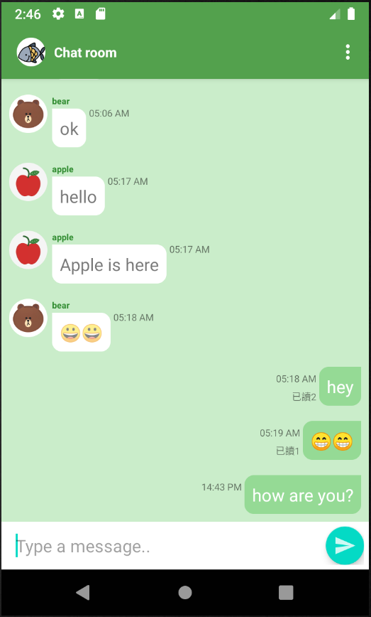

# ChatApp
- An Android app for chat room.
- Use Firebase (realtime database) to maintain this app
- Register/login by email, and start to chat with friends!

## Overview
### Start the app
- Choose register/login when using the app for the first time.
- Next time when you open this app, it will be signed in automatically.
  

### Chat Room Overview
- Each message will be showed with the time stamp and the info that how many people have seen this message. 
  

### Edit your profile photo
  - click the profile photo, you can choose a image from your device and upload for updating the photo.
  
 

## Other screenshots
- Login

- Register

- The Menu for jumping to profile page/ logout the app

